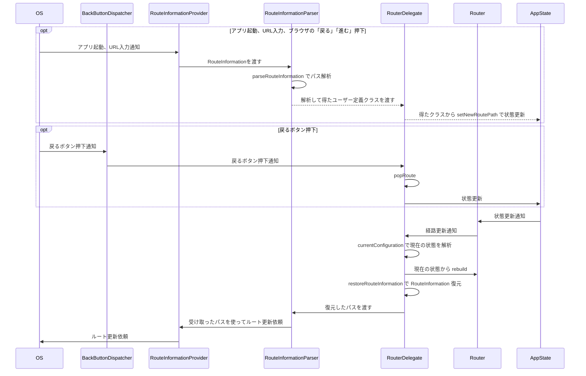

# Navigator 2.0 攻略

# はじめに
Navigator 1.0 の課題を克服するために導入された Navigator 2.0
しかし、かなり複雑で日本語でしっかり解説されているサイトなどが少なすぎる。
ここで Navigator 2.0 で困ることはないと言えるくらいのものにしたいと考えています。

その前に、[go_router](https://pub.dev/packages/go_router) など Navigator 2.0 を隠蔽してくれるライブラリはたくさんあります。そちらで問題がないのであればそちらを使うようにしてください。
さらにそれ以前に pop と push が基本の Navigator 1.0 で問題ないのであればそちらを使用するようにしましょう。

lib/**/navigation/ が主に Navigator 2.0 関連のファイルになります。
Navigator 2.0 勉強中のため完全なものとは言えないですが、Navigator 2.0 を使用して以下のような動作を実装しています

- flutter_hooks, hooks_riverpod を使用する
- ログイン状態によるリダイレクト処理
- ネストされた Router を用いて BottomNavigation を使用
- TabBar や BottomNavigation を使用しつつ画面遷移によるスクロール位置のリセット防止(保存と復元)
- Android の戻るボタンによる BottomNavigation の履歴を遡行


# 概要

正確ではないフローですが、雰囲気はこんな感じです




# 詳細

# Navigator 2.0 を使用するために必要なもの

## Router
Router なんて言っているがいつもの Widget
基本的に最も上位に Material.router を使用する
routerDelegate と routeInformationParser を設定する必要があり、それぞれざっくりと説明すると
routeInformationParser は OS との通信
routerDelegate はそれ以外の、状態の構築や widget の構築などを行う
(ネストする場合は Router を直接使う)

```dart
class MyApp extends StatelessWidget {
  MyApp({Key? key}) : super(key: key);

  @override
  Widget build(BuildContext context, WidgetRef ref) {
    return MaterialApp.router(
      routerDelegate: //...,
      routeInformationParser: // ...,
      backButtonDispatcher: // ...,
    );
  }
}
```

## RouteInformationParser

以下のように RouteInformationParser<ユーザー定義クラス>を extends する必要がある

`class MainRouteInformationParser extends RouteInformationParser<RoutePath>`

ユーザー定義クラスは RouterDelegate とのやり取りなどで必要になるもので、情報が載せられるなら本当にどんなものでも良い。どんな情報を載せるべきかは routerDelegate なども見てから考えると良いかもしれない
私は以下のような抽象クラスを定義して、具象クラスでそれぞれのパス情報を載せるようにしていることが多い
```dart
abstract class RoutePath {
  Uri uri;
  RoutePath(String path) : uri = Uri(path: path);
}

class SamplePath extends RoutePath {
  SamplePath() : super('/${SamplePath.path}');
  static const path = 'xxxxxx';
}
```

### parseRouteInformation メソッド
OS から通知される RouteInformation (厳密には RouteInformationProvider から通知される) をアプリの状態である ユーザー定義クラス (ここでは RoutePath) に変換する
初回起動時や Web では URL を入力したり、「戻る」「進む」ボタンが押されたときに呼び出される
Async な理由は auth guard、つまり認証チェックなどを行うため

返したものは routerDelegate の setNewRoutePath に渡されて、それをもとにアプリの状態を構築されることになる。

```dart
@override
Future<RoutePath> parseRouteInformation(
  RouteInformation routeInformation) async {
  // ...
}
```

補足
- RouteInformationProvider も自分で定義することができる
  - 基本的にはデフォルトで提供してくれるものを使用していればいいので特に考えなくていい

### restoreRouteInformation メソッド
Web 開発をするなら必要になるもの
現在のアプリの状態からパスに変換して、OS に通知することで URL が更新される
これは routerDelegate の currentConfiguration の後に呼び出される
```dart
@override
RouteInformation? restoreRouteInformation(RoutePath configuration) {
  // ...
}
```
ユーザー定義クラスに uri などを定義させておけば
`return RouteInformation(location: configuration.uri.path);`
のみの実装で事足りる


## RouterDelegate

アプリの画面など様々なことを担うアプリの根幹となるもの

`RouterDelegate<ユーザー定義クラス>` を extends する必要がある

### with ChangeNotifier

Router に更新通知するために mixin すべきもの
`with ChangeNotifier`

### with PopNavigatorRouterDelegateMixin
`with ChangeNotifier, PopNavigatorRouterDelegateMixin<ユーザー定義クラス>`
PopNavigatorRouterDelegateMixin を mixin することで戻るボタンによる Navigator の 簡単な popRoute メソッド を実装してくれる。
デフォルトでは以下のものが提供される
```dart
GlobalKey<NavigatorState>? get navigatorKey;
@override
Future<bool> popRoute() {
  final NavigatorState? navigator = navigatorKey?.currentState;
  if (navigator == null) {
    return SynchronousFuture<bool>(false);
  }
  return navigator.maybePop();
}
```
navigatorKey を使用している Navigator で widget がスタックされていたら一番上のものをポップし、なくなったらアプリを閉じる、という動作
もし、Navigator でスタックしていなくてもアプリを閉じてほしくない場合
例えば BottomNavigationBar などを使用しており履歴をたどってほしい場合などに自分で override するといい

### currentConfiguration ゲッター
Router が経路変更を検知したときなどに呼び出される
ユーザー定義クラスを取得でき、この情報を使って widget の構築などが行われる
```dart
@override
RoutePath? get currentConfiguration {
  // ...
}
```

補足
アプリ起動時 RouteInformationParser で parseRouteInformation が呼び出されるが、非同期処理
RouterDelegate は parseRouteInformation が終わるまでは、currentConfiguration で得たパスから画面を構築する

### build メソッド

いつもの build メソッド
現在のアプリの状態から widget を切り替えるための Navigator を返す
onPopPage は Navigator.pop() のコールバック関数
Navigator がスタックされたときに出る AppBar の戻るボタンを押したときなどの挙動を記述する

```dart
@override
Widget build(BuildContext context) {
  return Navigator(
    key: navigatorKey,
    pages: [
      const MaterialPage(child: SampleViewWidget()),
    ],
    onPopPage: _onPopPage,
  );
}

bool _onPopPage(Route<dynamic> route, dynamic result) {
  // ...
}
```


### setNewRoutePath メソッド
RouteInformationParser.parseRouteInformation で解析された ユーザー定義クラス (RoutePath) を使って状態を更新する
当然 RouteInformationParser.parseRouteInformation の後に呼び出される

```dart
@override
Future<void> setNewRoutePath(RoutePath configuration) async {
  // ...
}
```


### その他メソッド

特に override する必要のなさそうなメソッドの紹介だけはしておく

#### setRestoredRoutePath
状態の復元中に Router によって呼び出される
```dart
@override
Future<void> setRestoredRoutePath(RoutePath configuration) {
  return setNewRoutePath(configuration); // デフォルト
}
```

#### setInitialRoutePath
アプリ起動時にのみ呼び出される状態更新処理
```dart
@override
Future<void> setInitialRoutePath(RoutePath configuration) async {
  return SynchronousFuture<void>(null);
}
```


# おわりに
未だに理解できていないところが多そうで、間違っている部分があるかもしれません。
気づいた点があれば指摘していただけますと幸いです。

何度も言いますが、go_router などで問題なく構築できるのであれば、そちらを強く推奨します。
多くの人が解説していないということは多くのプロジェクトでは go_router で事足りるからだと思います。