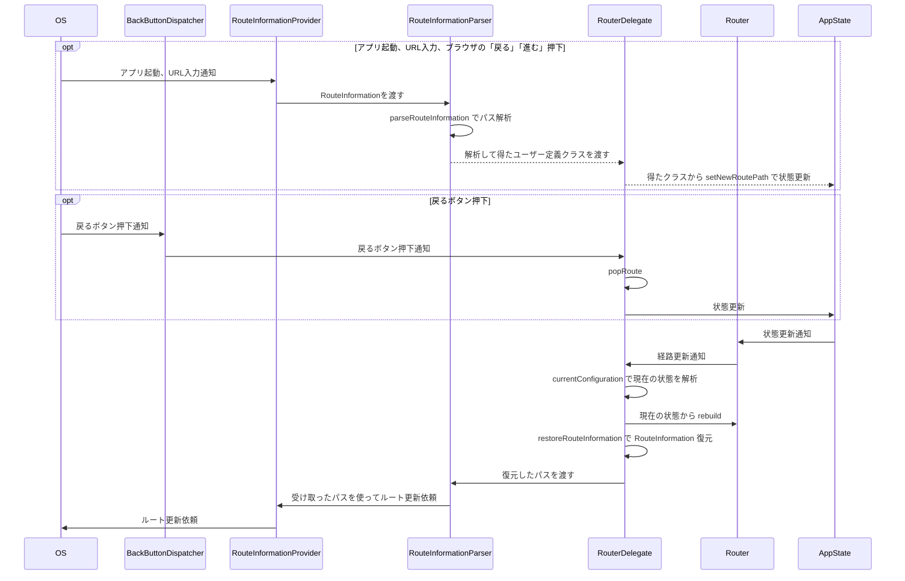

# Navigator 2.0 攻略

Flutter の Navigator 2.0 がかなり複雑なので、このリポジトリを見れば困ることはないようにしたいというリポジトリ

## Navigator 2.0 フロー

正確ではないフローですが、雰囲気はこんな感じです

```mermaid
sequenceDiagram
    participant OS
    participant BackButtonDispatcher
    participant RouteInformationProvider
    participant RouteInformationParser
    participant RouterDelegate
    participant Router
    participant AppState

    opt アプリ起動、URL入力、ブラウザの「戻る」「進む」押下
        OS->>RouteInformationProvider: アプリ起動、URL入力通知
        RouteInformationProvider->>RouteInformationParser: RouteInformationを渡す
        RouteInformationParser->>RouteInformationParser: parseRouteInformation でパス解析
        RouteInformationParser-->>RouterDelegate: 解析して得たユーザー定義クラスを渡す
        RouterDelegate-->>AppState: 得たクラスから setNewRoutePath で状態更新
    end
    opt 戻るボタン押下
        OS->>BackButtonDispatcher: 戻るボタン押下通知
        BackButtonDispatcher->>RouterDelegate: 戻るボタン押下通知
        RouterDelegate->>RouterDelegate: popRoute
        RouterDelegate->>AppState: 状態更新
    end
    AppState->>Router: 状態更新通知
    Router->>RouterDelegate: 経路更新通知
    RouterDelegate->>RouterDelegate: currentConfiguration で現在の状態を解析
    RouterDelegate->>Router: 現在の状態から rebuild
    RouterDelegate->>RouterDelegate: restoreRouteInformation で RouteInformation 復元
    RouterDelegate->>RouteInformationParser: 復元したパスを渡す
    RouteInformationParser->>RouteInformationProvider: 受け取ったパスを使ってルート更新依頼
    RouteInformationProvider->>OS: ルート更新依頼
```

## 注意点

アプリ起動時 RouteInformationParser で parseRouteInformation が呼び出されますが、非同期処理です
RouterDelegate は parseRouteInformation が終わるまでは、currentConfiguration で得たパスから画面を構築します